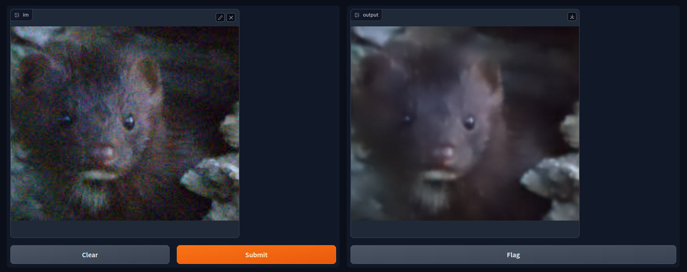

# Im-Denoise
Get rid of noise artifacts from images. Inspired by (https://arxiv.org/pdf/1904.07396v2.pdf)



## Installation
- First clone the repository
    ```
    git clone https://github.com/Acedev003/ImDenoise.git
    ```
- Install dependencies
    ```
    pip install -r requirements.txt
    ```
- Run the program
    ```
    cd gradio_app
    python main.py (or python3 main.py)
    ```